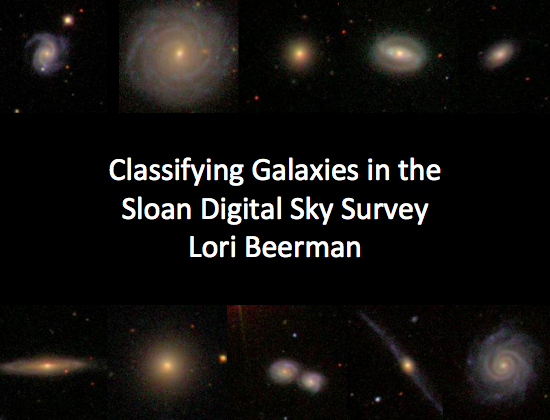
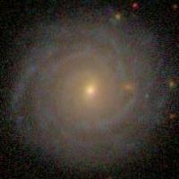
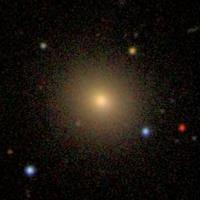
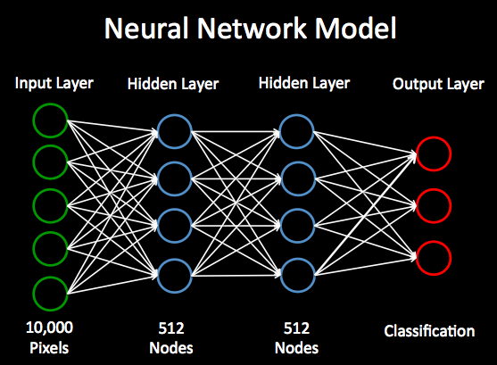
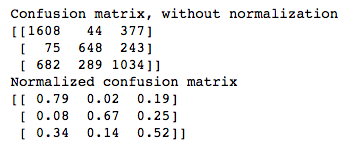
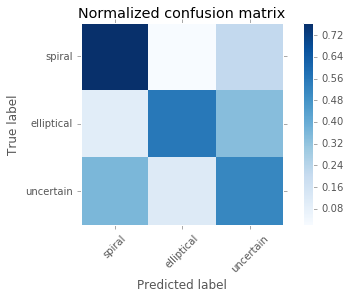
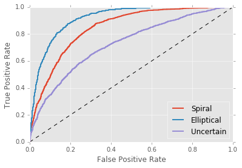
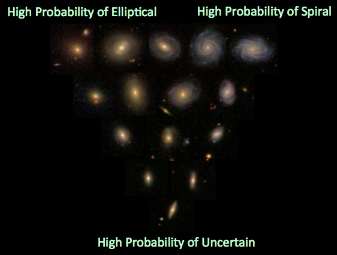

This is my capstone project for the Galvanize Data Science Immersive program, Seattle October 2015 cohort.

##Motivation
Galaxy classification has long been vital to understanding of how galaxies form and evolve. Spiral galaxies are disk-shaped, and are the site of active star formation.  Many of these galaxies will eventually merge together to form massive elliptical galaxies. In addition to these major types of galaxies, there are irregular galaxies which are not disk or spherical and are often the result of the merger of two or more galaxies, and lenticular galaxies which have some characteristics of both spirals and ellipticals. 

With the advent of large imaging surveys such as the Sloan Digital Sky Survey (SDSS), the amount of astronomical data generated has grown exponentially. In the past, astronomers would classify galaxies based on a by-eye viewing of the image. This is simply not possible today when astronomers have hundreds of millions of galaxies to classify.

Crowd sourcing through sites such as GalaxyZoo is a viable means of obtaining classifications for the SDSS galaxies.  However, automatic classification of galaxies will enable astronomers to devote their time and energy into understanding the physical processes that created these galaxies and that in turn shaped the universe in which we live.

##Data
I classified 20,000 of the brightest and largest galaxies from SDSS (Alam et al. 2015) and compared them to the classifications that were generated from GalaxyZoo (Lintott et al. 2011). I scraped the SDSS skyserver website (http://skyserver.sdss.org/dr12/en/home.aspx) to obtain these images, which are 200 x 200 x 3 pixels.  A sample spiral and elliptical galaxy are shown below.

Spiral Galaxy             |  Elliptical Galaxy
:-------------------------:|:-------------------------:
  |  

##Model
Neural networks are often used for image classification. theano (http://deeplearning.net/software/theano/) is a neural network implementation in Python which can be used for image classification. I used this neural network implementation to classify SDSS galaxies. I trained the neural network using the GalaxyZoo classifications, while leaving out a fraction of the data as the test set. I then tested the accuracy of the neural network predictions based on the results from the GalaxyZoo classifications. Since the time to train the neural network can become lengthy, I trained this network using an AWS GPU instance, which is better suited to training neural networks on images.

##Results

The overall accuracy on the test data is 66%, while random guessing among the three categories would give 33% accuracy.

The confusion matrix shows predicted label vs. true label, and is darker where more classifications are, we can see it usually does a good job, and that the model does especially well at separating spirals and ellipticals.

 

)

This ROC curve is made by treating each classifier as binary:  e.g. is it spiral or not spiral.  The AUC is largest for the elliptical classification at 0.92, the next highest is for spiral at 0.85, and uncertain is the lowest, at 0.73.

The model also gives a probability for each galaxy that it is in each classification.  The visualization below shows typical galaxies for various probabilities from the model.  This shows that high probability galaxies have very distinct morphologies and look like classic elliptical and spirals, while the typical uncertain galaxy appears smaller on the image, likely due to distance, and appears similar to lenticular galaxies. The middle area is where most of the misclassifications come from, and even visually, it is harder to tell what type of galaxy it is, as some may be transitioning from spiral to elliptical.

I found that I can obtain higher accuracies by looking at only the galaxies with high probabilities.  When I restrict the sample to only high probability spirals, the accuracy of correctly identifying spiral galaxies is 77%.  When I do the same for ellipticals, the accuracy is 82%, and for uncertain, it is 80%.

##Future Work
Next I can add more complex morphological classifications, such as clockwise spiral, anti-clockwise spiral, edge-on, barred, or merger. This model could also be extended for use in image classifications in other disciplines.

##References
Alam, S. et al. 2015, ApJS, 219, 12

Lintott, C. et al. 2011, MNRAS, 410, 166

